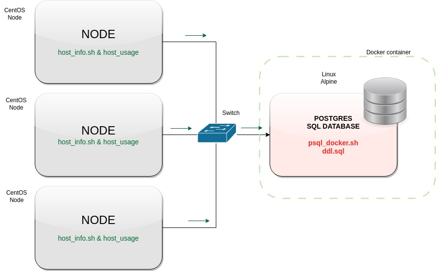

# Introduction

Designed and implemented a Linux cluster monitoring agent using bash scripts. 
The system allows users to keep track of a cluster's hardware and usage information in real-time.
The project has been implemented using bash scripting in combination of sql scripting.
To accomplish this, four bash scripts have been created.
The data is updated regularly using the cron command, ensuring
that the information about the cluster's performance is always up-to-date.

# Quick Start
- Create a docker container running Alpine Linux using psql_docker.sh bash script.
- Start a **Postgres SQL** instance using psql_docker.sh bash script.
- Create tables using ddl.sql.
- Fetch **hardware specifications** of the nodes and store them to the DB using host_info.sh.
- Fetch **hardware usage data** into the DB using host_usage.sh.
- Automate the execution of host_usage.sh with the **Crontab** setup.

# Implemenation
The first script, psql_docker.sh, sets up a Docker container running the Postgres database on
a Linux Alpine system.
The sql scripts create the tables to store the hardware information and the cpu and memory usage.
The other two scripts, host_info and host_usage fetch the system information from each hosting node
(CPU and memory usage) as well the hardware specifications on the running machine as well of
hardware components.

## Architecture
The following graph schematically represents the configuration of a cluster with 3 nodes and a containerized database instance.

## Scripts
- **psql_docker.sh** (set up a docker container with Linux Alpine and start a Postgres Instance)
- **host_info.sh**(fetch the information about the node's hardware and store it to the database)
- **host_usage.sh** (fetch the information about the node's usage and store it to the database)
- **crontab** (setup automatic uploads each minutes for the cpu usage and memory usage)
- **ddl.sql** (define the tables for the retrieved information)
- **queries.sql** (describe what business problem you are trying to resolve)

## Database Modeling
### HOST INFO TABLE

| Column Name       | Data Type         | Constraints                 |
|-------------------|-------------------|-----------------------------|
| id                | SERIAL NOT NULL   | PRIMARY KEY (id)            |
| hostname          | VARCHAR NOT NULL  |                             |
| cpu_number        | INT2 NOT NULL     |                             |
| cpu_architecture  | VARCHAR NOT NULL  |                             |
| cpu_model         | VARCHAR NOT NULL  |                             |
| cpu_mhz           | FLOAT8 NOT NULL   |                             |
| l2_cache          | INT4 NOT NULL     |                             |
| timestamp         | TIMESTAMP NULL    |                             |
| total_mem         | INT4 NULL         |                             |

### HOST USAGE TABLE

| Column Name    | Data Type       | Constraints                                            |
|----------------|----------------|--------------------------------------------------------|
| id             | SERIAL          | PRIMARY KEY, NOT NULL                                  |
| timestamp      | TIMESTAMP      | NOT NULL                                               |
| host_id        | INTEGER        | NOT NULL, FOREIGN KEY REFERENCES PUBLIC.host_info(id)  |
| memory_free    | INTEGER         |                                                        |
| cpu_idle       | INTEGER         |                                                        |
| cpu_kernel     | INTEGER         |                                                        |
| disk_io        | INTEGER         |                                                        |
| disk_available | INTEGER         |                                                        |

## Test
The monitoring system has been tested on a single node running Linux CentOS. 

## Deployment
The app has been deployed to run automatically on the machine where is installed.
Cron command will execute the scripts each minute.
The SQL server has been deployed on an **Alpine Linux container using Docker**.
A volume has been used to store the data permanent.
All the scripts have been uploaded to my **GitHub** repository.

## Improvements
- I would implement an ASCII graphical representation of the usage of all the connected nodes.
- It could be interesting to create another table with the downtime of the machines on the cluster.
- Enable the access to the information from a webpage accessible from anywhere.
